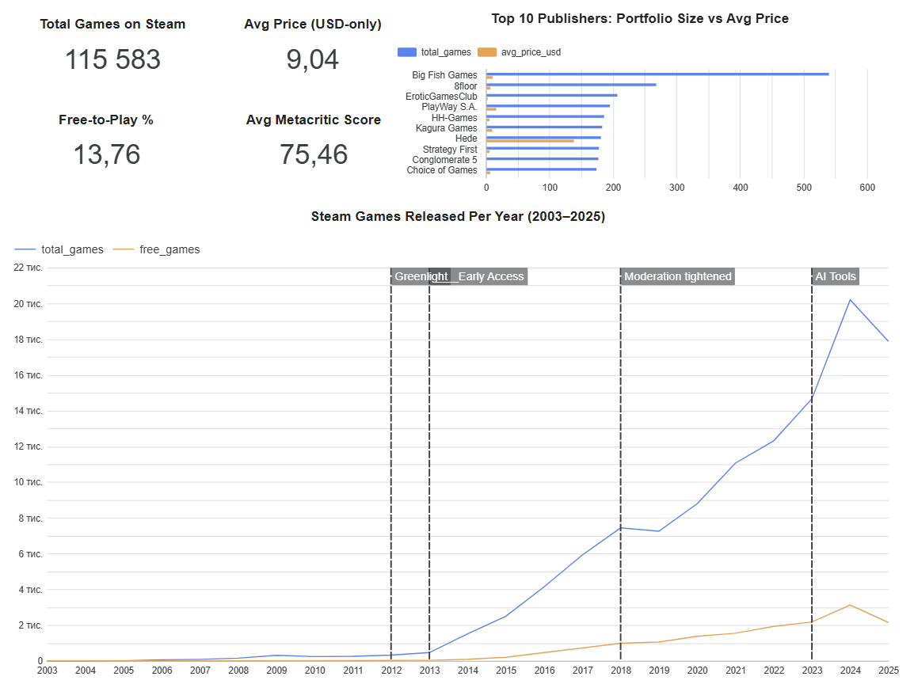
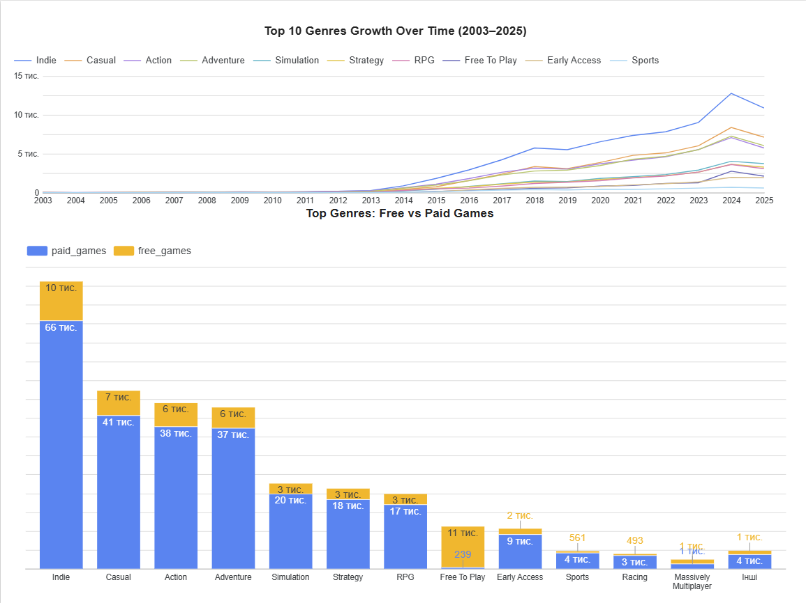
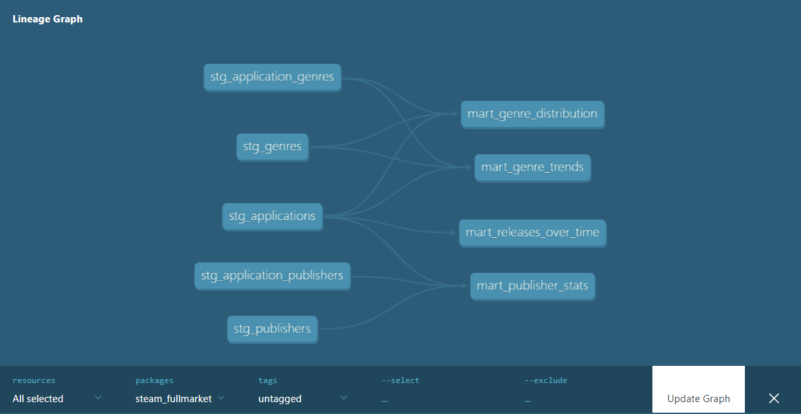

# 🎮 SteamFullMarket — Steam Games Analytics Pipeline

An end-to-end data engineering pipeline that ingests, transforms, and visualizes 22 years of Steam gaming marketplace data (2003–2025).

---

## 📋 Problem Statement

Steam has grown from a small digital storefront in 2003 to the world's largest PC gaming marketplace, with over 100,000 games released as of 2025. Understanding how this market evolved — which genres dominate, how monetization strategies shifted, and what platform milestones drove growth — requires processing and analyzing large-scale catalog data.

This project builds an end-to-end data pipeline that ingests 239,664 Steam applications from the [Steam Dataset 2025](https://www.kaggle.com/datasets/crainbramp/steam-dataset-2025-multi-modal-gaming-analytics), processes and transforms the data using modern data engineering tools, and delivers an interactive dashboard revealing key trends in the Steam gaming ecosystem from 2003 to 2025.

---

## 🏗️ Architecture

```
┌──────────┐     ┌─────────────┐     ┌─────────────┐     ┌─────────────┐     ┌──────────────┐
│  Kaggle  │────▶│   Airflow   │────▶│     GCS     │────▶│  BigQuery   │────▶│  Data Studio │
│  (CSV)   │     │    (DAG)    │     │  (Parquet)  │     │  (dbt mart) │     │ (Dashboard)  │
└──────────┘     └─────────────┘     └─────────────┘     └─────────────┘     └──────────────┘
                                                                │
                                                           ┌────▼────┐
                                                           │Terraform│
                                                           │  (IaC)  │
                                                           └─────────┘
```

---
## 🛠️ Technologies

| Component | Technology |
|---|---|
| Cloud | Google Cloud Platform (GCP) |
| Infrastructure as Code | Terraform |
| Workflow Orchestration | Apache Airflow 2.9.1 (Docker Compose) |
| Data Lake | Google Cloud Storage |
| Data Warehouse | BigQuery (partitioned & clustered) |
| Transformations | dbt Core 1.11.8 |
| Visualization | Data Studio |
| Containerization | Docker & Docker Compose |
| Language | Python 3.10+ |

---

## 📂 Project Structure

```
SteamFullMarket/
├── terraform/                    # GCS bucket + BigQuery dataset
│   ├── main.tf
│   ├── variables.tf
│   └── outputs.tf
├── airflow/
│   ├── dags/
│   │   └── steam_pipeline.py     # Kaggle → GCS → BigQuery
│   ├── docker-compose.yml
│   ├── .env.example
│   └── logs/
├── dbt/
│   ├── models/
│   │   ├── staging/
│   │   │   ├── schema.yml
│   │   │   ├── stg_applications.sql
│   │   │   ├── stg_genres.sql
│   │   │   ├── stg_application_genres.sql
│   │   │   ├── stg_publishers.sql
│   │   │   └── stg_application_publishers.sql
│   │   └── marts/
│   │       ├── schema.yml
│   │       ├── mart_releases_over_time.sql
│   │       ├── mart_genre_distribution.sql
│   │       ├── mart_genre_trends.sql
│   │       └── mart_publisher_stats.sql
│   ├── dbt_project.yml
│   └── profiles.yml.example
├── docs/images/
├── requirements.txt
└── README.md
```

---

## 📊 Dashboard

**[View Live Dashboard](https://datastudio.google.com/s/tVHye6K6NAQ)**

### Page 1 — Steam Platform Evolution


### Page 2 — Genre Analysis


The dashboard includes:
- **Steam Games Released Per Year (2003–2025)** — temporal analysis with key platform milestones annotated (Greenlight, Early Access, Moderation tightened, AI Tools)
- **Top 15 Genres: Free vs Paid Games** — categorical breakdown of game monetization by genre
- **Top 10 Genres Growth Over Time** — genre market share evolution
- **Top Publishers by Game Count** — publisher portfolio analysis

---

## 📐 Data Model

### Staging Layer (Views)
Raw data is cleaned and filtered at the staging layer — only `type = 'game'` records with valid release dates (2003–2025) are passed to marts.

| Model | Description |
|---|---|
| `stg_applications` | Games only, cleaned fields, 2003–2025 |
| `stg_genres` | Genre lookup table |
| `stg_application_genres` | App-genre junction table |
| `stg_publishers` | Publisher lookup table |
| `stg_application_publishers` | App-publisher junction table |

### Marts Layer (Partitioned + Clustered Tables)

| Model | Partition | Cluster | Rationale |
|---|---|---|---|
| `mart_releases_over_time` | `release_year` (int64) | `release_year` | Partitioned by release_year to match the primary filter in temporal dashboard tiles |
| `mart_genre_distribution` | — | `genre_description` | Clustered by genre_description to optimize genre filter queries |
| `mart_genre_trends` | `release_year` (int64) | `genre_description` | Partitioned by release_year and clustered by genre for efficient time+genre filtering |
| `mart_publisher_stats` | — | `publisher_name` | Clustered by publisher_name to optimize publisher lookup queries |

### dbt Lineage Graph



---

## 🔍 Key Insights

- Steam catalog grew **50x** between 2012 (Greenlight launch) and 2024
- **Indie** is the dominant genre with 76,000+ games — nearly double the next genre
- **~14%** of Steam games are free-to-play
- AI tools contributed to a record **20,000+ games** released in 2024
- Average price of paid games (USD): **~$9**
- **Free To Play** genre has 97.9% free games — highest monetization consistency of any genre
- **Big Fish Games** leads publisher rankings with 540 games

---

## 🚀 How to Reproduce

### Prerequisites

- GCP account with billing enabled
- [Terraform](https://developer.hashicorp.com/terraform/install) >= 1.3
- [Docker](https://docs.docker.com/get-docker/) + Docker Compose
- Python 3.10+
- [Kaggle API key](https://www.kaggle.com/docs/api) (`~/.kaggle/kaggle.json`)
- GCP Service Account key with BigQuery Admin + Storage Admin permissions

### Step 1: Clone Repository

```bash
git clone https://github.com/pyrojenka/SteamFullMarket.git
cd SteamFullMarket
```

### Step 2: Infrastructure (Terraform)

```bash
cd terraform
terraform init
terraform apply
```

Creates GCS bucket `steam-fullmarket-raw` and BigQuery dataset `steam_fullmarket`.

### Step 3: Environment Variables

```bash
cp airflow/.env.example airflow/.env
```

Edit `airflow/.env`:
```
AIRFLOW_UID=1000
AIRFLOW_GID=0
GOOGLE_CREDENTIALS_PATH=/path/to/your/gcp-service-account.json
KAGGLE_CONFIG_PATH=/path/to/your/kaggle.json
```

### Step 4: Run Airflow Pipeline

```bash
cd airflow
docker compose up airflow-init
docker compose up -d airflow-webserver airflow-scheduler
```

Open `http://localhost:8080` (admin/admin) and trigger the `steam_pipeline` DAG.

| Task | Description |
|---|---|
| `download_from_kaggle` | Downloads 9 CSV files from Kaggle |
| `upload_to_gcs` | Converts CSV → Parquet, uploads to GCS |
| `load_to_bigquery` | Loads Parquet from GCS into BigQuery raw tables |

### Step 5: Run dbt Transformations

```bash
cd ..
python3 -m venv .venv
source .venv/bin/activate
pip install dbt-bigquery
```

> ⚠️ Copy `dbt/profiles.yml.example` to `dbt/profiles.yml` and update with your GCP project ID and keyfile path.

```bash
cd dbt
dbt run
dbt test
```

---

## 📦 Dataset

**[Steam Dataset 2025](https://www.kaggle.com/datasets/crainbramp/steam-dataset-2025-multi-modal-gaming-analytics)** by VintageDon (Donald Fountain)

- 239,664 Steam applications collected via official Steam Web API
- Collection period: August–September 2025
- Tables used: `applications`, `genres`, `application_genres`, `categories`, `application_categories`, `publishers`, `application_publishers`, `developers`, `application_developers`
- License: [CC BY 4.0](https://creativecommons.org/licenses/by/4.0/)
